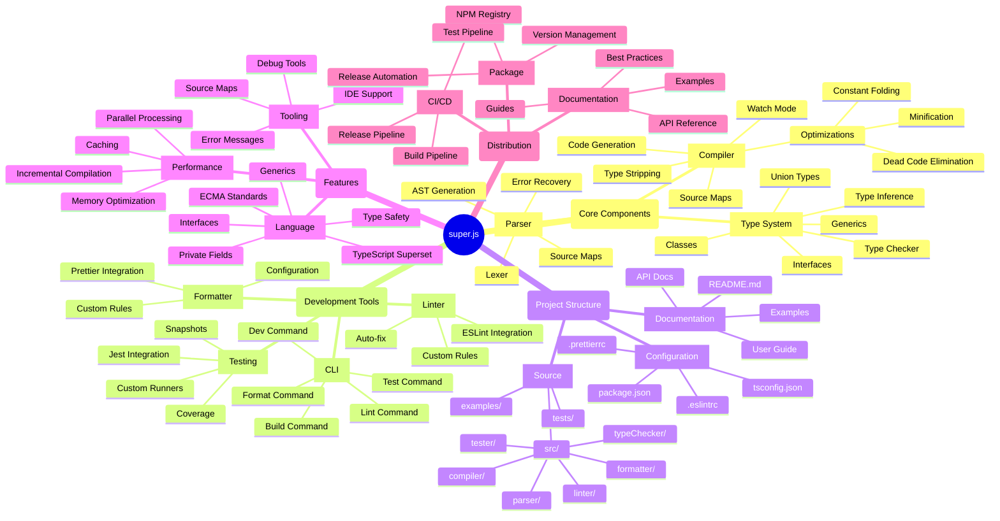

# super.js Compiler Architecture

## Legend

- **Root**: The main project name
- **Core Components**: Essential parts of the compiler
- **Development Tools**: Tools for development workflow
- **Project Structure**: Organization of files and directories
- **Features**: Language and tooling capabilities
- **Distribution**: Deployment and distribution aspects

## Status

- ✅ Implemented
  - Basic parser with AST generation
  - Type stripping
  - Code generation
  - Source maps
  - Private fields transformation
  - Basic type checking
  - CLI build command
  - Example projects

- 🚧 In Progress
  - Optimization passes
  - Watch mode
  - Error recovery
  - Type system enhancements

- 📅 Planned
  - IDE integration
  - Performance optimizations
  - Testing infrastructure
  - Documentation site 